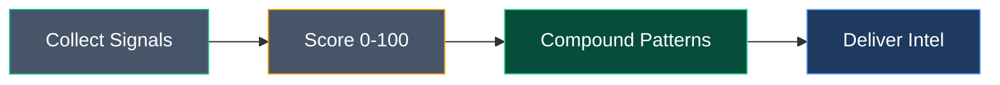

# Brand Design

Generate on-brand HTML designs for LinkedIn carousels, article images, banners, and infographics. Output is a self-contained HTML file with inline CSS, Google Fonts, SVG graphics, and an html2canvas download button for PNG export.

The user's prompt describes what they want. Infer the format from context, or ask if unclear.

---

## FORMATS

| Format | Dimensions | Use |
|---|---|---|
| `carousel` | 1080 x 1080 px (per slide) | LinkedIn carousel posts (multiple slides in one HTML) |
| `article-image` | 1080 x 607 px | LinkedIn article header images |
| `banner` | 1584 x 396 px | LinkedIn profile/company banner |
| `infographic` | 1080 x 1350 px | Tall-format data visuals |
| `social-post` | 1080 x 1080 px (single) | Single-image LinkedIn posts |

---

## BRAND SYSTEM (Cool Slate + Signal Accents v2)

### Colors — Punch Backgrounds (dark bold slides)
For single-image formats (banners, article images, social posts), pick ONE background. For **carousels with 5+ slides**, use up to 3 distinct punch backgrounds for visual variety:
- **Bookend slides** (first & last): Cool Slate `#475569` (anchors the carousel identity)
- **Interior punch slides**: Mix in Deep Forest and/or Midnight Blue (max one of each)
- All breathe slides stay on Cloud `#f3f4f6` regardless

| Name | Hex | RGB | Use |
|---|---|---|---|
| **Cool Slate** | `#475569` | 71, 85, 105 | Default. Blue-tinted neutral. Carousel bookends. |
| **Slate Deep** | `#334155` | 51, 65, 85 | Cards/insets on slate |
| **Slate Light** | `#64748b` | 100, 116, 139 | Hover states, subtle variations |
| **Deep Forest** | `#064e3b` | 6, 78, 59 | Growth/compound topics |
| **Midnight Blue** | `#1e3a5f` | 30, 58, 95 | Data/strategy/intel topics |

### Colors — Breathe Backgrounds (light content slides)

| Name | Hex | Use |
|---|---|---|
| **Cloud** | `#f3f4f6` | Breathe slide background |
| **Card White** | `#ffffff` | Cards on cloud background |

### Colors — Text

| Token | On Dark | On Light |
|---|---|---|
| Primary | `#ffffff` | `#111827` |
| Secondary | `#d1d5db` | `#6b7280` |
| Muted | `#9ca3af` | `#9ca3af` |
| Body | `#d1d5db` | `#64748b` |

### Colors — Signal Accents

| Name | Base | Bright | Use |
|---|---|---|---|
| **Emerald** | `#10b981` | `#34d399` | Primary accent, CTAs, positive. Use bright variant for text on dark bg. |
| **Amber** | `#f59e0b` | `#fbbf24` | Highlights, reactive signals |
| **Signal Blue** | `#3b82f6` | `#60a5fa` | Information, links, trust |
| **Danger Red** | `#ef4444` | `#f87171` | Alerts, negative metrics |
| **Purple** | `#8b5cf6` | `#a78bfa` | Process, scoring, tertiary |
| **Cyan** | `#06b6d4` | — | Optional accent |

### Typography

```
Font import: https://fonts.googleapis.com/css2?family=Inter:wght@400;500;600;700;800;900&family=JetBrains+Mono:wght@400;500;600;700&display=swap

--font-sans: 'Inter', system-ui, sans-serif
--font-mono: 'JetBrains Mono', monospace
```

| Level | Font | Weight | Size | Tracking | Use |
|---|---|---|---|---|---|
| Display XL | Inter | 900 | 64px | -2px | Hero headline on punch slides |
| Display Hollow | Inter | 900 | 64px | -2px | Outlined keyword. stroke 3px. |
| Display | Inter | 900 | 48px | -1.5px | Secondary display |
| Hollow Variant | Inter | 900 | 48px | -1.5px | Outlined keyword. stroke 2.5px. |
| H1 | Inter | 800 | 36-40px | -0.5px | Section titles (use 40px on breathe slides) |
| H2 | Inter | 700 | 28px | -0.3px | Card titles |
| Body | Inter | 500 | 18-20px | 0 | Content (≥18px for mobile readability) |
| Small | Inter | 500 | 16px | 0 | Descriptions (never below 16px) |
| Caption | JetBrains Mono | 600 | 12px | 0.5px | Labels, metadata |
| Mono Label | JetBrains Mono | 700 | 12-14px | 1-2px | Uppercase section labels |

### Hollow Text Rules
- Use ONLY for 1-3 keyword emphasis words, NEVER full sentences
- Minimum font size: 48px
- Stroke: 3px at 64px, 2.5px at 48px — never below 2px
- Max 3 hollow words per slide
- CSS: `color: transparent; -webkit-text-stroke: 3px <accent-bright>;`
- In mixed fill+hollow, only hollow the final keyword

### Spacing & Borders

```
Base unit: 8px
Radii: 4px (sm), 8px (md), 12px (lg), 24px (pill)
Shadows:
  sm: 0 2px 8px rgba(0,0,0,0.06)
  md: 0 4px 16px rgba(0,0,0,0.10)
  dark: 0 4px 20px rgba(0,0,0,0.3)
Border on dark: rgba(255,255,255,0.12)
Border on light: #e5e7eb
```

---

## CSS VISUAL ELEMENTS (Isometric & Decorative)

Use pure CSS visuals to break up text-heavy slides. These replace stock imagery and are fully self-contained in the HTML file. ALL visuals MUST use **2D-only CSS** to ensure html2canvas compatibility for PDF/PNG export.

### html2canvas Compatibility (CRITICAL)
- **NEVER use:** `perspective()`, `rotateX()`, `rotateY()`, `rotateZ()` (3D), `translateZ()`, `transform-style: preserve-3d`, `backdrop-filter: blur()`
- **SAFE to use:** `transform: rotate()` (2D), `translate()`, `scale()`, positional offsets (`top/left`), `box-shadow`, `border`, `opacity`, `linear-gradient()`
- Test: if the visual looks correct as a flat screenshot, it will render correctly in html2canvas

### Glass-Panel Style
Semi-transparent branded cards with glowing borders. Use on dark punch slides.
```css
/* Template — substitute brand color values */
background: rgba(16,185,129, 0.08-0.12);     /* brand color at 8-12% opacity */
border: 1.5px solid rgba(52,211,153, 0.25-0.40); /* bright variant at 25-40% */
border-radius: 14px;
box-shadow: 0 0 24px rgba(16,185,129, 0.08), 0 6px 20px rgba(0,0,0,0.15);
```
Use emerald for positive/growth, amber for caution/reactive, blue for data/trust.

### Isometric Layer Stack
Diagonal arrangement of 3 equal-width panels, offset 18-22px per step. Creates a "stacked layers" visual without 3D transforms.
```
Layout: Layer 1 at left:0, Layer 2 at left:22px, Layer 3 at left:44px
Container: 360px wide × 420px tall
Each layer: position: absolute; top values spaced 120-130px apart
Panel size: 300px wide, padding 24px 28px
Layer label: 12px mono, uppercase
Layer title: 19px sans, bold
Time/metric values: 21px mono
Cost/secondary: 13px mono
Connectors: SVG arrows with departure dot + diagonal line + arrowhead polygon
Optional: scale/direction indicator with subtle SVG arrows (opacity: 0.25)
```
Best for: validation layers, tech stack comparisons, progressive frameworks.

### Channel-Routing Diagram
Central node branching to 2-3 destination cards via SVG bezier curve connectors.
```
Layout:
- Central node: 110×110px, left: 0, vertically centered
- Node text: 11px label + 16px mono title
- Connectors: SVG bezier curves (cubic C command) with departure dots + arrowhead polygons
- Channel cards: positioned right of node (left: 140px), 190px wide, min-height 175px
- Card label: 12px mono, uppercase
- Card title: 19px sans, bold
- Card subtitle: 15px sans
- Audience label: 12px mono + 16px value
- Top card: emerald accent, bottom card: amber accent
```
Best for: audience segmentation, message-channel matching, distribution strategies.

### Floating Hypothesis Panels
Scattered, slightly rotated cards with status indicators. Use on cover/intro slides.
```
Layout: 3 cards stacked vertically in 320px wide × 520px tall container
- Each card 270px wide, rotated -3deg to +2deg
- Each card offset slightly left/right (stagger: 0-30px)
- Card padding: 22px 26px
- Panel label: 12px mono, uppercase
- Panel text: 19px sans, semibold
- Status dot: 8px circle + 13px mono label ("Unvalidated", "Untested")
- Glass-panel style on dark backgrounds
- Vertical spacing: ~170px between card tops
```
Best for: opening slides that challenge assumptions, hypothesis framing.

### Two-Column Punch Layout
When adding visuals to punch slides, use a side-by-side layout:
```css
/* Wrapper: replaces the full-width flex-column */
display: flex; align-items: center; gap: 24-32px; position: relative;

/* Left column (text): */
flex: 1;  /* takes ~65-70% */

/* Right column (visual): */
flex-shrink: 0; width: 280-340px;  /* takes ~30-35% */
```
- Constrain sub text `max-width` to 480-520px to avoid overlapping the visual
- Reduce headline font-size by 2-4px (e.g., 58px instead of 62px) to fit the narrower column
- Keep the stat-row at full width below the two-column layout

---

## POSITIONING RULES (Sara-Derived)

### Headlines
- Own 30-40% of vertical space
- Center-aligned on punch slides
- Left-aligned body text on breathe slides
- Display XL (64px) for covers, H1 (36px) for content slides

### Content Zones
- Maximum 3 zones per slide (headline, hero visual, footer/stats)
- One idea per slide. No wall-of-text.

### Margins
- **40px** all sides on 1080x1080 carousel
- **48px** on 1200x628 banner
- **40px 50px** on 1080x607 article image

### Floating Elements
- Rotate 2-3 degrees for depth
- Use `box-shadow: var(--shadow-md)` — never flat-stack

### Accent Bars
- Solid emerald bar (4px height) on top-left edge of punch slides
- Vertical emerald stripe (4px width) on left edge for emphasis
- NEVER use multi-color gradients (reads as AI-generated)

---

## SLIDE STRUCTURE (Carousels)

Alternate between **punch** and **breathe** slides:

### Punch Slide (dark background)
```
- Full-bleed background: var(--slate) or forest/midnight
- Emerald accent bar: top-left, 4px height, ~30% width
- Mono label: uppercase, 12px, letter-spacing 2px, emerald-bright
- Display headline: 64px, white, -2px tracking
- Optional hollow keyword in accent-bright
- Supporting text: 1 line max, #d1d5db, 20px
- Bottom stats bar: JetBrains Mono numbers in accent colors
```

**Two-column variant** (when adding CSS visuals):
```
- Same background, accent bar, mono label
- Content area: display: flex; align-items: center; gap: 24-32px;
- Left column (flex: 1): headline (54-58px) + sub (max-width: 480-520px)
- Right column (flex-shrink: 0; width: 280-340px): glass-panel visual
- Stat row stays full-width below the two-column area
```

### Breathe Slide (light background)
```
- Background: #f3f4f6
- White cards with border-radius 12px, shadow-sm
- H1 title: #111827, 36-40px (prefer 40px for readability)
- Body: #64748b, 18-20px (never below 18px)
- Card body: 20px minimum
- Accent-colored left borders on cards (4px, emerald/amber/blue)
- Data in JetBrains Mono
```

### Vertical Centering (eliminate bottom dead space)
Wrap content areas in this flex container to distribute vertical space evenly:
```css
flex: 1; display: flex; flex-direction: column; justify-content: center;
```
Apply to: any slide section that has dead space below its content. This pushes content to the vertical center rather than stacking from the top.

### Text Density Guidelines
- **Card body copy**: 1 sentence max. Trim ruthlessly.
- **Sub text**: 1-2 sentences. If it wraps past 3 lines, it's too long.
- **Slide rule**: If a slide feels text-heavy, add a CSS visual element (see CSS VISUAL ELEMENTS section) rather than trying to make the text smaller.
- **Step cards**: Title + 1-line description. Move detailed explanations to the next breathe slide.

---

## CAROUSEL READABILITY PRINCIPLES (CRITICAL)

LinkedIn carousels are viewed primarily on mobile. A 1080×1080px canvas renders at ~350-400px on a phone screen — a **~3× compression ratio**. This means a 12px font on canvas renders at ~4px on screen, which is invisible. Every font size and spacing decision must account for this.

### Minimum Font Size Thresholds (1080×1080 carousel)

| Element | Minimum | Recommended | Never Below |
|---|---|---|---|
| Mono labels (uppercase) | 12px | 12-14px | 11px |
| Body / descriptions | 18px | 19-20px | 16px |
| Card titles | 22px | 22-24px | 20px |
| Sub text / supporting copy | 20px | 20-22px | 18px |
| Status text / cost labels | 13px | 13-15px | 12px |
| Pipeline stage text | 18px | 18-20px | 16px |
| Metric / stat values | 21px | 21-26px | 20px |
| Display headlines | 48px | 54-64px | 48px |
| Section H1 titles | 36px | 36-40px | 36px |
| Caption / metadata | 12px | 12-13px | 11px |

**Rule of thumb**: If you can't comfortably read it on a phone without zooming, it's too small. When in doubt, go 2-4px larger.

### Space Utilisation — No Dead Zones

```
Slide padding: 40px (not 56px) — reclaims 32px of usable vertical + horizontal space
Swipe CTA positioning: bottom: 44px; right: 40px;
Swipe arrow positioning: bottom: 44px; right: 40px;
Author block positioning: bottom: 44px; left/right: 40px;
```

- **Never leave >60px of empty space** at the top or bottom of a slide
- Use `flex: 1; display: flex; flex-direction: column; justify-content: center;` to vertically center content and eliminate dead zones
- If visual elements (layer stacks, channel diagrams, hypothesis panels) have blank space around them, **enlarge the element** to fill the available area rather than leaving dead zones

### Hollow Border Technique for Panel Prominence

When panels on dark backgrounds blend into the slide and become hard to distinguish, add hollow borders using the slide's accent colour at low opacity:

```css
/* Match border colour to the panel's thematic accent */
border: 1.5px solid rgba(52,211,153, 0.35);   /* Emerald — for growth/positive */
border: 1.5px solid rgba(251,191,36, 0.35);   /* Amber — for caution/reactive */
border: 1.5px solid rgba(96,165,250, 0.35);   /* Blue — for data/trust */
border: 1.5px solid rgba(255,255,255, 0.12);  /* Subtle white — for neutral panels */
```

- Use 1.5px stroke weight — thick enough to see on mobile, thin enough to stay elegant
- Opacity range: 0.25-0.40 depending on contrast needs
- Each panel on the same slide should use a **different accent colour** for visual distinction
- This technique mirrors the hollow text pattern: outlining for prominence without filling

### Pre-Publish Readability Checklist

Before finalising any carousel, verify every slide against this checklist:

1. ☐ **No font below 12px** on any element (including labels, status text, costs)
2. ☐ **Body text ≥ 18px** on all slides (both punch and breathe)
3. ☐ **Card titles ≥ 22px** — the entry point for scanning
4. ☐ **No dead zones** — top/bottom spacing ≤ 60px, content vertically centred
5. ☐ **Panels distinguishable** — hollow borders or clear visual separation on dark slides
6. ☐ **Swipe CTA visible** but not eating content space (44px from bottom/right)
7. ☐ **Glass panels readable** — text inside glass-panel cards ≥ 18px body, ≥ 12px labels
8. ☐ **SVG connectors aligned** — if element sizes changed, verify arrows/curves still connect correctly
9. ☐ **Slide padding = 40px** — not the old 56px default
10. ☐ **Test at 350px width** — shrink browser to phone size and verify all text is legible

---

## HTML TEMPLATE STRUCTURE

Every output file MUST follow this skeleton:

```html
<!DOCTYPE html>
<html lang="en">
<head>
<meta charset="UTF-8">
<meta name="viewport" content="width=device-width, initial-scale=1.0">
<title>{{TITLE}}</title>
<style>
  @import url('https://fonts.googleapis.com/css2?family=Inter:wght@400;500;600;700;800;900&family=JetBrains+Mono:wght@400;500;600;700&display=swap');
  * { margin: 0; padding: 0; box-sizing: border-box; }
  body {
    display: flex; flex-direction: column; justify-content: center;
    align-items: center; min-height: 100vh;
    background: #d0d0d0; padding: 40px; gap: 40px;
  }
  /* ... slide/banner styles ... */

  .download-btn {
    position: fixed; bottom: 30px; right: 30px;
    padding: 14px 28px; background: #333; color: white;
    border: none; border-radius: 8px;
    font-family: 'Inter', sans-serif; font-size: 14px;
    font-weight: 600; cursor: pointer; z-index: 100;
  }
  .download-btn:hover { background: #111; }
  .size-label {
    position: fixed; top: 15px; left: 50%; transform: translateX(-50%);
    font-family: 'JetBrains Mono', monospace; font-size: 12px; color: #888;
    background: #fff; padding: 6px 16px; border-radius: 6px;
    border: 1px solid #ddd; z-index: 100;
  }
</style>
</head>
<body>

<div class="size-label">{{FORMAT_LABEL}} — {{WIDTH}} x {{HEIGHT}}px</div>

<!-- SLIDES/BANNER CONTENT HERE -->
<div class="slide" id="slide-1">...</div>

<script src="https://cdnjs.cloudflare.com/ajax/libs/html2canvas/1.4.1/html2canvas.min.js"></script>
<script src="https://cdnjs.cloudflare.com/ajax/libs/jspdf/2.5.1/jspdf.umd.min.js"></script>

<div style="position: fixed; bottom: 30px; right: 30px; display: flex; gap: 10px; z-index: 100;">
  <button class="download-btn" style="position: static; background: #10b981;" onclick="downloadPDF()">Download as PDF (LinkedIn)</button>
  <button class="download-btn" style="position: static;" onclick="downloadPNG()">Download as PNG</button>
</div>

<script>
async function downloadPDF() {
  const btn = document.querySelector('[onclick="downloadPDF()"]');
  btn.textContent = 'Generating PDF...';
  btn.disabled = true;
  try {
    if (typeof html2canvas === 'undefined') throw new Error('html2canvas not loaded');
    if (!window.jspdf) throw new Error('jsPDF not loaded');
    const { jsPDF } = window.jspdf;
    const pdf = new jsPDF({ orientation: 'portrait', unit: 'px', format: [{{WIDTH}}, {{HEIGHT}}] });
    const slides = document.querySelectorAll('.slide');
    for (let i = 0; i < slides.length; i++) {
      btn.textContent = `Rendering slide ${i + 1} of ${slides.length}...`;
      const canvas = await html2canvas(slides[i], {
        scale: 2, useCORS: true, width: {{WIDTH}}, height: {{HEIGHT}}, logging: false
      });
      const imgData = canvas.toDataURL('image/jpeg', 0.95);
      if (i > 0) pdf.addPage([{{WIDTH}}, {{HEIGHT}}]);
      pdf.addImage(imgData, 'JPEG', 0, 0, {{WIDTH}}, {{HEIGHT}});
    }
    btn.textContent = 'Saving PDF...';
    pdf.save('{{FILENAME_BASE}}.pdf');
    btn.textContent = 'Download as PDF (LinkedIn)';
  } catch (err) {
    console.error('PDF generation failed:', err);
    alert('PDF generation failed: ' + err.message + '\n\nTry opening via localhost instead of file://');
    btn.textContent = 'Download as PDF (LinkedIn)';
  }
  btn.disabled = false;
}

async function downloadPNG() {
  const slides = document.querySelectorAll('.slide');
  for (let i = 0; i < slides.length; i++) {
    const canvas = await html2canvas(slides[i], {
      scale: 2, useCORS: true, width: {{WIDTH}}, height: {{HEIGHT}}
    });
    const link = document.createElement('a');
    link.download = `{{FILENAME_BASE}}-${i + 1}.png`;
    link.href = canvas.toDataURL('image/png');
    link.click();
    await new Promise(r => setTimeout(r, 500));
  }
}
</script>

</body>
</html>
```

---

## AUTHOR BLOCK (optional, for article images and banners)

Include when appropriate:
```html
<div style="position: absolute; bottom: 18px; right: 32px; display: flex; align-items: center; gap: 10px;">
  <div style="text-align: right;">
    <div style="font-family: 'Inter', sans-serif; font-size: 16px; font-weight: 600; color: #444;">Victor Ugochukwu</div>
    <div style="font-family: 'JetBrains Mono', monospace; font-size: 12px; font-weight: 500; color: #999;">by Victor Ugochukwu</div>
  </div>
  <div style="width: 56px; height: 56px; border-radius: 50%; overflow: hidden; border: 2.5px solid #ddd; box-shadow: 0 2px 8px rgba(0,0,0,0.08);">
    
  </div>
</div>
```

---

## SERVING & EXPORT NOTES

### file:// vs localhost
- **PDF download requires `localhost`** — browsers block CDN scripts (jsPDF, html2canvas) when opened via `file://` protocol due to CORS restrictions
- Always serve via local HTTP server: `python3 -m http.server 8899` from the design directory, or use the `.claude/launch.json` preview server
- PNG download may work on `file://` but is unreliable — prefer localhost for both
- If using Claude's preview tools, the launch.json server handles this automatically

### LinkedIn Carousel Upload
1. Download as PDF via the green button
2. On LinkedIn: Create Post → Document → Upload the PDF
3. LinkedIn automatically converts each page into a swipeable slide
4. Recommended: 5-10 slides. More than 12 reduces engagement.

---

## FIGMA EXPORT WORKFLOW

After generating the HTML file:
1. Open in browser, download as PNG via the button
2. Import PNG into Figma as a frame reference
3. Or recreate in Figma using the brand colors/fonts from `brand-tokens.json`

For Figma-native workflows, use the Figma MCP tools:
- `get_design_context` to read existing Figma brand templates
- `get_variable_defs` to check Figma color variables match brand tokens
- `get_screenshot` to preview Figma frames

---

## CANVA EXPORT WORKFLOW

For Canva-based creation, use the Canva MCP tools:
- Use `generate-design` with detailed prompts incorporating the brand colors and typography
- Use `start-editing-transaction` + `perform-editing-operations` to edit existing Canva designs
- Use `upload-asset-from-url` to bring in the headshot or exported PNGs
- Export via `export-design` in PNG/PDF format

When writing Canva prompts, embed the brand spec:
- "Use background color #475569, white text in Inter Black, accent color #10b981"
- "Headlines should be large and bold, center-aligned, occupying 30-40% of vertical space"

---

## CONTENT PRINCIPLES

- **Tone**: Authoritative but not boring. Technical credibility with energy.
- **Default audience**: B2B SaaS leaders, PMMs, revenue teams — but adapt to whatever the user specifies.
- **Data**: Include 2-3 stats in JetBrains Mono with colored accents when the content calls for it.
- **One idea per slide** — never cram.
- **Punch/breathe alternation** — bold dark slides for impact, light slides for detail.
- This is a **general-purpose brand design skill** — it applies Victor's visual identity to ANY topic. Use it for personal branding, side projects, thought leadership on any subject, client work, event graphics, or anything the user asks for.

---

## FIGMA FLOWCHARTS & DIAGRAMS

When the user needs a flowchart, decision tree, process diagram, or pipeline visualization, use the Figma MCP `generate_diagram` tool to create it directly in FigJam.

### Supported Diagram Types
- **Flowcharts** (`graph LR` or `flowchart LR`) — process flows, pipelines
- **Sequence diagrams** (`sequenceDiagram`) — interaction flows, API sequences
- **State diagrams** (`stateDiagram-v2`) — lifecycle states, status transitions
- **Gantt charts** (`gantt`) — timelines, project plans, launch schedules
- **Decision trees** (`graph TD`) — scoring logic, routing decisions

### Brand-Consistent Mermaid Styling
Apply brand colors sparingly using Mermaid classDef. Use LR (left-to-right) direction by default.



### When to Use Figma Diagrams vs HTML
| Need | Tool |
|---|---|
| Quick process flow, decision tree, pipeline | `generate_diagram` (Figma/FigJam) |
| Polished visual with stats, hollow text, brand layout | HTML file (this skill) |
| Timeline with milestones and data cards | HTML file (see article_image_1_drift.html pattern) |
| Sequence/interaction diagram | `generate_diagram` (Figma/FigJam) |
| Client-ready carousel slides | HTML file |

### Example Diagram Prompts
User says: "Flowchart of the signal collection pipeline"
-> Use `generate_diagram` with `graph LR`, brand node colors, quoted text labels

User says: "Decision tree for competitive signal scoring"
-> Use `generate_diagram` with `graph TD`, color-code decision paths with brand accents

User says: "Gantt chart for Q2 launch plan"
-> Use `generate_diagram` with `gantt`, keep it simple unless user asks for detail

### Diagram Rules
- Always use `LR` (left-to-right) direction by default for flowcharts
- Put ALL shape text and edge labels in quotes: `["Text"]`, `-->|"Label"|`
- Do NOT use emojis in Mermaid code
- Apply brand colors sparingly (2-4 key nodes, not every node)
- Use Cool Slate (#475569) for primary nodes, accent colors for emphasis nodes
- Keep diagrams simple unless the user specifically asks for detail

---

## EXAMPLE PROMPT PATTERNS

User says: "Create a 5-slide carousel about narrative drift"
-> Generate 5 alternating punch/breathe slides at 1080x1080, using Cool Slate background

User says: "Make an article image for my post about competitive readiness"
-> Generate 1 article image at 1080x607, using breathe (light) background with data visualization

User says: "LinkedIn banner showing the compound intelligence pipeline"
-> Generate 1 banner at 1584x396

User says: "Forest green carousel on growth compounding"
-> Use Deep Forest (#064e3b) instead of default slate

User says: "Midnight blue infographic on market signals"
-> Use Midnight Blue (#1e3a5f) background, tall 1080x1350 format

User says: "Flowchart of the CI pipeline"
-> Use `generate_diagram` Figma tool with brand-colored nodes in Mermaid LR format

User says: "Decision tree for signal scoring logic"
-> Use `generate_diagram` Figma tool with graph TD, color-coded decision paths

User says: "Carousel with a pipeline diagram on slide 3"
-> Generate HTML carousel, but use SVG-based diagram inline (not Figma) for that slide

User says: "Carousel about messaging validation with visuals"
-> Use two-column punch layout: text on left, isometric layer stack on right (glass-panel style, 2D-safe CSS)

User says: "Make the carousel less text-heavy"
-> Add CSS visual elements (layer stacks, channel-routing diagrams, floating panels) to punch slides. Trim card body copy to 1 sentence max.

User says: "7-slide carousel with mixed backgrounds"
-> Use 3 backgrounds: Cool Slate bookends (slides 1, 7), Deep Forest on one interior punch, Midnight Blue on another. All breathe slides stay Cloud.

User says: "I need the carousel as a PDF for LinkedIn"
-> Ensure jsPDF CDN is loaded alongside html2canvas. Add green "Download as PDF" button. Remind user to open via localhost, not file://.
